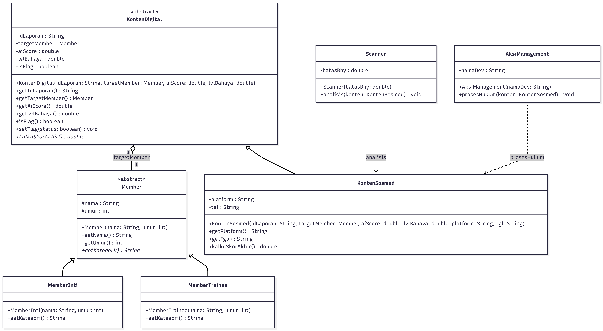
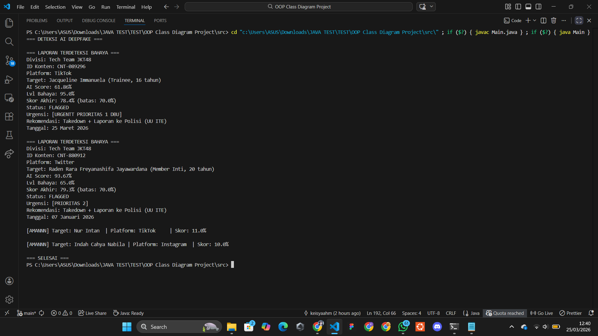

# STRUKDAT OOP - Project Simulasi Deteksi Deepfake

#### Activity 04 - Object-Oriented Programming

* *Nama:* Keisya Halimah Mulia
* *NRP:* 5027251068
* *Kelas:* A

---

## Daftar Isi
1. [Deskripsi Kasus](#1-deskripsi-kasus)
2. [Class Diagram](#2-class-diagram)
3. [Kode Program Java](#3-kode-program-java)
4. [Screenshot Output](#4-screenshot-output)
5. [Penjelasan Prinsip OOP](#5-penjelasan-prinsip-oop)
6. [Keunikan Program](#6-keunikan-program)

---

## 1. Deskripsi Kasus

Proyek ini mensimulasikan sistem pemantauan berbasis **Object-Oriented Programming (OOP)** untuk mendeteksi konten *AI-generated* atau *deepfake* yang mengarah kepada pelecehan seksual dan menargetkan member JKT48.

### Latar Belakang, solusi, deskripsi panjang

Dari pengamatan saya management jkt48 kewalahan untuk mengecek atau melakukan patroli rutin serta menindak kasus pelecehan seksual dalam kasus pelecehan seksual dalam ranah digital, dibuktikan dari **[Detik News](https://news.detik.com/berita/d-8395072/fotonya-diedit-pakai-grok-ai-jadi-tak-senonoh-freya-jkt48-lapor-polisi)** Member JKT48 (Freya) harus mengumpulkan bukti secara mandiri dari berbagai platform sosmed dalam rentang waktu **2022-2025**, sedangkan freya jkt48 (2006) itu baru berumur 16 tahun/masih dibawah umur.  

Butuh waktu bertahun-tahun untuk menindak lanjut kasus ini, mengingat member jkt48 juga berjumlah **60+**+, management jkt48 kelawahan jika harus mengecek konten-konten tsb satu per satu.

Maka sistem simulasi ini dibuat agar management cukup mengirimkan data yang dicurigai dalam bentuk `kontenDigital` lalu maka sistem akan otomatis mengscan peluang `aiScore` apakah konten tersebut hasil editan AI dan merupakan konten yang mengarah ke pelecehan seksual. Jika peluang di atas **70%** maka akan muncul label bahaya `isFlag`, setelah diberi label akan di panggil class untuk menindak lanjuti `aksiManagement` sesuai dengan `lvlBahaya` (jika korban dibawah 18th akan muncul URGENTT PRIORITAS 1 DBU/Di Bawah Umur).

***(simulasi ini hanya berfokus pada merancang struktur class dan hubungan antar class saja. Tnpa machine learning atau API dari pihak ketiga)***

---

## 2. Class Diagram


**[Source Code Class Diagram (Mermaid)](src/codeDIAGRAM.mmd)**

---

## 3. Kode Program Java
Seluruh kode program=
**[Main.java](src/Main.java)**

### Alur Prgram
```
Main
 │
 ├── Buat Scanner (minimum 70%)
 ├── Buat AksiManagement
 ├── Buat objek Member (MemberInti/MemberTrainee)
 ├── Buat objek KontenDigital (barang bukti)
 │
 └── Untuk setiap kasus:
      ├── scanner.analisis()
      │    ├── Hitung skor = (aiScore + lvlBahaya) / 2
      │    ├── Jika skor >= 70 → setFlag(true)
      │    └── Jika skor < 70  → print AMAN
      │
      └── management.prosesHukum()
           ├── Jika tidak diflag → skip
           ├── Cek umur korban
           │    ├── < 18 → URGENTT PRIORITAS 1 DBU
           │    └── >= 18 → PRIORITAS 2
           └── Print laporan lengkap
```
### Penjelasan Code
- Ini merupakan data korban (Member sbg abstrak class) yang menjadi kerangka untuk `MemberInti` dan `MemberTrainee` serta method `getKategori()` dibuat `abstract` agar penerapan kategori bisa beda tiap turunan.
```abstract class Member { //korban
    protected String nama;
    protected int umur;

    public Member (String nama, int umur){
        this.nama = nama;
        this.umur = umur;
    }

    public String getNama(){
        return nama;
    }
    public int getUmur(){
        return umur;
    }

    public abstract String getKategori();
}
```

- Member inti dan trainee menjadi turunan korban dan mewarisi `nama` dan `umur` lewat `super`, `getKategori` itu polymorphism dimana dipanggil dg code sama tapi hasil beda.
```//Mem inti
class MemberInti extends Member{
    public MemberInti(String nama, int umur){
        super(nama, umur); //construktor inheritance
    }

    @Override
    public String getKategori(){
        return "Member Inti";
    }
}
//Mem trainee
class MemberTrainee extends Member{
    public MemberTrainee (String nama, int umur){
        super(nama, umur);
    }
    @Override
    public String getKategori(){
        return "Trainee";
    }
}
```

- `KontenDigital`abstrak class dari barang bukti, semua di private agar tdk dimanipulasi diluar class, `targetMember` tipenya `Member` jadi bisa buat semua korban, `hitungSkorAkhir()` dibuat `abstract` karena rumus skor bisa berbeda tergantung jenis konten, `isFlag` juga cm bisa diubah dari `setFlag` tidak bisa dari luar.
```
abstract class KontenDigital{
    private String idLaporan;
    private Member targetMember;
    private double aiScore;
    private double lvlBahaya;
    private boolean isFlag;

    //skor akhir
    public abstract double kalkuSkorAkhir();

    public void setFlag(boolean status) {
        this.isFlag = status;
    }
}
```

- `KontenSosmed` turunan dari `KontenDigital` yang berguna untuk hitung rumus flag bahaya, jadi nilai dari `aiScore` akan ditambah `LvlBahaya` lalu dibagi 2, jika melebihi 70% maka melebihi flag.
```
class KontenSosmed extends KontenDigital{
    private String platform;
    private String tanggal;

    @Override
    public double kalkuSkorAkhir(){
        return (getAiScore() + getLvlBahaya()) / 2.0;
    }
}
```
- `Scanner` ini cek batasnya kalo aman bakal ke print itu dan skip `aksiManagement`, terus batasnya di private agar tidak bisa di manipulasi.
```
class Scanner{
    private double batasBahaya;

    public Scanner(double batasBahaya){
        this.batasBahaya=batasBahaya;
    }

    public void analisis (KontenSosmed konten){
        double skor = konten.kalkuSkorAkhir();

        if (skor>=batasBahaya){
            konten.setFlag(true);
        }else{
            konten.setFlag(false);
            System.out.printf("\n[AMANNN] Target: %-10s | Platform: %-10s | Skor: %.1f%%\n", 
                konten.getTargetMember().getNama(),
                konten.getPlatform(),
                skor);
        }
    }
}
```
- `aksiManagement` ini untuk menentukan laporan, kalo flag aman bakal di skip, kalo engga bakal dicek umur (jika dibawah 18 th diprioritaskan lapor berwajib), lalu di print laporan full.
```
class AksiManagement{

    public void prosesHukum(KontenSosmed konten){
        if (!konten.isFlag())
            return;

        //dibawah umur
        String urgensi = (korban.getUmur()<18)
            ? "[URGENTT PRIORITAS 1 DBU]"
            : "[PRIORITAS 2]";

        //PRINTFLN LAPORAN LENGKAP
```
- Karena hanya simulais, maka bagian `analisis` dianggap selesai lalu lanjut ke `prosesHukum` untuk tindak lanjut, kalo langsung ke prosesHukum laporannya bakal kacau karena flagnya belum di set.
```
        scanner.analisis(kasus1); management.prosesHukum(kasus1);
        scanner.analisis(kasus2); management.prosesHukum(kasus2);
        scanner.analisis(kasus3); management.prosesHukum(kasus3);
        scanner.analisis(kasus4); management.prosesHukum(kasus4);
```

---

## 4. Screenshot Output


---


## 5. Penjelasan Prinsip OOP
- **Abstraction**
pada `abstract class Member` dan `abstract class KontenDigital`, serta dalam `getKategori()` dan `hitungSkorAkhir()` yang mana disini hanya ditulis luarnya saja, detailnya dikelas turunan.
- **Inheritance**
penerapannya di class `MemberInti` dan `MemberTraiene` yang diturunkan pakai `extends Member` serta pada `KontenSosmed` pakai `extends KontenDigital` yang mana ini agar tidak perlu menulis sifat yang sama berulang kali.
- **Encapsulation** `aiScore` dan `lvlBahaya` di `KontenDigital` dibuat `private`. Akses data hanya melalui *getter*, dan perubahan status `isFlag` hanya bisa dilakukan lewat method `setFlag()` karena mereka merupakan data yang rawan dan berbahaya jika dimanipulasi.
- **Polymorphism** jika perintah `korban.getKategori()` dijalankan oleh sistem, outputnya otomatis menyesuaikan dari ("Member Inti" atau "Trainee") tergantung apa yang sedang diproses saat itu. Ini seperti nama methodnya sama tetapi hasilnya berbeda.

---

## 6. Keunikan Program
- Masih terikat dengan cybersec.
- Kasus yang saya gunakan nyata, terbaru dan belum ditemukan solusinya.
- Member berusia dibawah 18 tahun diperlakukan khusus dg warning khusus karena anak dibawah umur juga dilindungi UU Perlindungan Anak.


---

